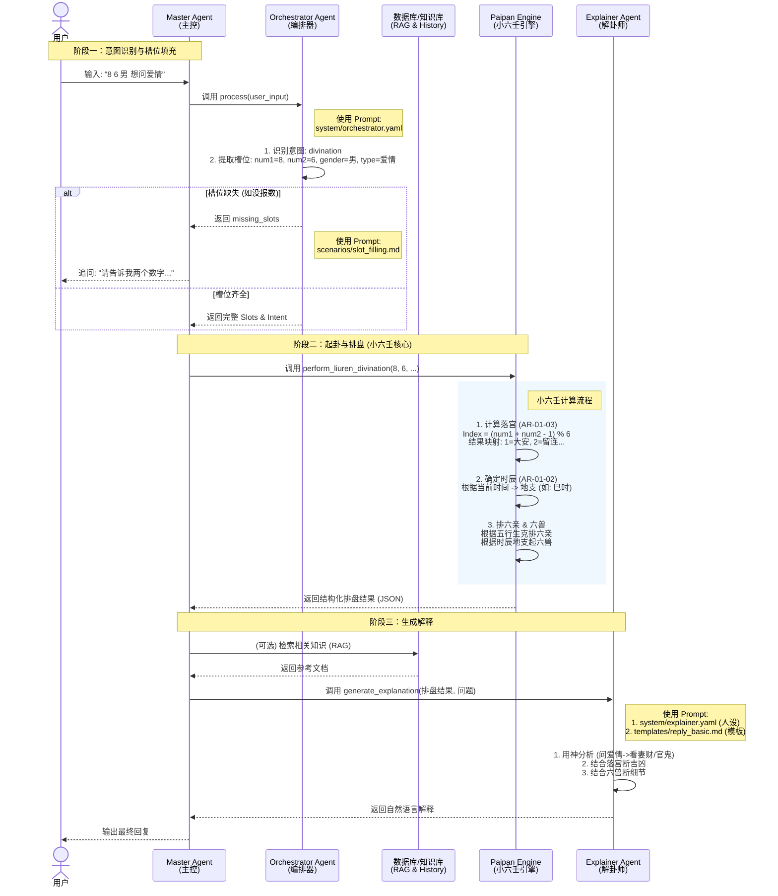

# 项目 Prompt 体系与交互流程说明

本文档详细列出了项目中的 Prompt 分类及其作用，并展示了用户交互与小六壬计算的完整流程。

## 1. Prompt 列表与分类

项目中的 Prompt 主要位于 `backend/ai_agents/prompts` 目录下，按功能分为系统角色、场景对话、回复模板和工具描述四类。

### 1.1 系统角色 (System Prompts)
定义 Agent 的核心人设、职责和基础知识库。

| 文件路径 | 角色 | 作用描述 |
| :--- | :--- | :--- |
| `system/orchestrator.yaml` | **编排器 (Orchestrator)** | 负责意图识别（占卜/历史/咨询）、槽位提取（报数、性别、问题类型）和算法路由。 |
| `system/explainer.yaml` | **解卦大师 (Explainer)** | 扮演"小六壬占卜大师"，负责用神选择（根据问题定六亲/六神）、结合卦象（六宫、六兽）进行吉凶判断，并提供建议。包含核心的小六壬知识。 |
| `system/base.yaml` | **基础人设** | 定义通用的 AI 行为规范（目前为空）。 |

### 1.2 场景对话 (Scenario Prompts)
处理特定对话场景，如追问缺失信息。

| 文件路径 | 场景 | 作用描述 |
| :--- | :--- | :--- |
| `scenarios/slot_filling.md` | **槽位填充追问** | 当用户输入缺少必要信息（如未报数、未提供性别）时，Orchestrator 使用此模板生成自然的追问语句。 |
| `scenarios/clarification.md` | **澄清追问** | 用于模糊意图的澄清（目前为空）。 |
| `scenarios/error_handling.md` | **错误处理** | 用于处理异常输入的回复。 |

### 1.3 回复模板 (Template Prompts)
用于规范化最终输出的格式。

| 文件路径 | 模板类型 | 作用描述 |
| :--- | :--- | :--- |
| `templates/reply_basic.md` | **基础解卦模板** | Explainer Agent 生成最终回复的骨架。包含起卦信息（时间、报数）、排盘结果（六宫、六兽、六亲）和详细的解卦文本结构。 |
| `templates/reply_advanced.md` | **进阶解卦模板** | 用于更复杂的输出格式。 |

### 1.4 工具描述 (Tool Prompts)
用于让 LLM 理解如何调用外部工具。

| 文件路径 | 工具名称 | 作用描述 |
| :--- | :--- | :--- |
| `tools/liuren_tool.md` | **小六壬工具** | 描述 `perform_liuren_divination` 工具的功能、参数（number1, number2, gender 等）及返回值格式，供 Agent 决策调用。 |
| `tools/rag_tool.md` | **RAG 工具** | 知识库检索工具描述。 |
| `tools/history_tool.md` | **历史记录工具** | 查询历史占卜记录的工具描述。 |
| `tools/profile_tool.md` | **用户画像工具** | 管理用户画像信息的工具描述。 |

---

## 2. 用户交互与小六壬计算流程

下图展示了从用户输入到最终解卦的完整数据流转。

### 关键流程说明

1.  **输入处理 (Orchestrator)**
    *   用户输入被 `orchestrator.yaml` 定义的规则解析。
    *   如果用户说 "8 6"，系统识别为 `num1=8`, `num2=6`。
    *   如果缺少关键信息，系统会根据 `slot_filling.md` 进行追问。

2.  **小六壬计算 (Engine)**
    *   **落宫算法**: `(num1 + num2 - 1) % 6`。结果对应：1-大安, 2-留连, 3-速喜, 4-赤口, 5-小吉, 6-空亡。
    *   **排盘**: 结合当前的**时辰**（自动获取）来确定六兽（青龙、白虎等）的起始位置，并根据五行生克关系排出六亲（兄弟、官鬼等）。

3.  **解释生成 (Explainer)**
    *   LLM 接收结构化的排盘数据（如：`落宫: 速喜`, `六兽: 朱雀`）。
    *   根据 `explainer.yaml` 中的知识库（如：速喜代表喜庆，朱雀代表口舌），结合用户问题（如：问爱情），生成最终的运势解读和建议。
