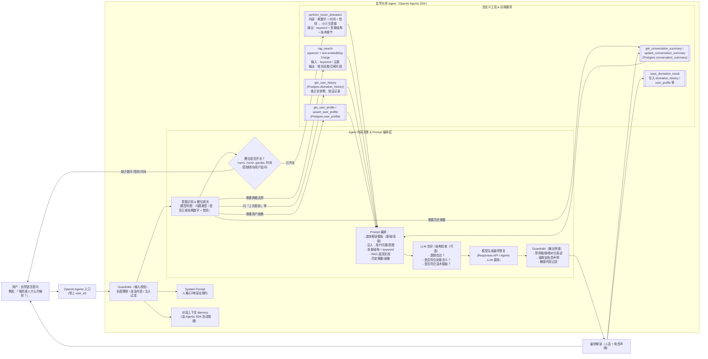

<div align="center">
<h1>玄学大师 Agent & 后端设计总览</h1>
<p>面向“小六壬 + RAG + Memory + 可扩展工具”场景的生产级架构</p>
</div>

---

## 目录
- 背景与目标
- **项目架构（三层 + 双模块）→ 详见 [ARCHITECTURE.md](./ARCHITECTURE.md)**
- 整体架构图（Mermaid）
- 核心模块说明
- Agent 常用模式引用（结合 `example/agent_patterns`）
- 工具（Tool）清单与 Schema 摘要
- 数据库 & RAG 设计
- Memory 策略与示例
- Prompt 组织规范
- 开发与运行步骤（Quick Start）
- 迭代路线（Next Steps）
- 附录：原始设计草稿保留
- OpenSpec 集成与用法

---

## 背景与目标
我们希望构建一个“玄学大师”智能体，具备：
- 自然语言对话与多轮上下文理解
- 支持小六壬占卜：两数字 + 性别 + 时间 → 结构化卦象
- 可插入 RAG：引用经典文本/注释增强解释可信度
- 可扩展工具：用户画像、历史记录、反馈、支付、通知等
- 可演进：管控 Prompt、加 Guardrails、并行执行、评审循环（LLM as judge）

技术选型：OpenAI Responses / Agents SDK + Postgres(pgvector) + Python 后端（FastAPI 或 Starlette）+ SQLAlchemy。

---

## 整体架构（Mermaid）


---

## 核心模块说明
- Intent & Slot Filling：抽取 `num1,num2,gender,ask_time,question_type`，缺则追问。
- Divination Engine：小六壬算法（你现有 `core/` 内逻辑或 `XLR/services/divination_service.py`）。
- RAG：向量召回经典文本（解释宫位、用神、生克、案例对比）。
- Memory：长期（用户画像 / 历史摘要）+ 短期（当前会话上下文缓存）。
- Guardrails：输入合法性（数字范围、时间不能是未来），输出合规（不做过度承诺、无禁词）。
- Evaluation (LLM-as-a-Judge)：可对初稿解释进行自检并重写，提升稳定性与一致性。

---

## 双 Agent 职责分层（明确两段流水线）
为实现“通用玄学算法”解耦，推荐将主逻辑拆分为两个核心 Agent：

### Agent A：Orchestrator（意图/槽位 → 算法调用）
职责：
1. 解析用户自然语言 → 意图分类（占卜 / 历史 / 寻物 / 纯咨询 / 其它算法）。
2. 槽位填充与校验：`num1,num2,gender,ask_time,timezone,location,question_type,algorithm_hint?`。
3. 选择算法插件（若用户指定或根据意图路由）。
4. 调用算法插件（统一接口），得到结构化结果 `{result,features,confidence,meta}`。
5. 整合 RAG 触发需求（是否需要典籍支撑）。
6. 形成“解释输入包”传递给 Agent B：
```json
{
  "question": "原始问题",
  "intent": {...},
  "slots": {...},
  "algorithm_id": "xlr-liuren",
  "plugin_result": {"result": {...},"features": {...},"confidence": 0.82, "meta": {...}},
  "rag_chunks": [...?],
  "profile": {...?},
  "history_summary": "..."
}
```

### Agent B：Explainer（结构化结果 → 人类友好回答）
职责：
1. 接收上一步打包对象 + 补充的 RAG / 用户画像 / 历史摘要。
2. 根据回复模板（基础/高级）组装 Prompt。
3. 可选执行 LLM-as-Judge：初稿 → 评审 → 改写。
4. 应用输出 Guardrails（措辞、免责声明、风险筛除）。
5. 返回最终回答并触发“结果保存工具”（历史记录、对话摘要更新）。

优势：
- 算法与解释分离：新增算法只需实现插件，不影响解释逻辑。
- 便于插入评审、并行检索、缓存策略。
- 输出阶段可以统一风格与安全规约。

---

## 算法插件抽象（适配任意玄学算法）
目标：让 Orchestrator 对具体算法“零感知”，通过统一接口与注册中心动态发现与调用。

### 接口定义（示例）
`AlgorithmAdapter`：
```python
class AlgorithmAdapter:
    id: str  # 唯一 ID，如 "xlr-liuren", "bazhi", "liuyao"

    def describe(self) -> dict:
        return {
            "id": self.id,
            "name": "小六壬排盘",
            "input_schema": {...},
            "output_schema": {...},
            "examples": [...]
        }

    def validate(self, inputs: dict) -> tuple[bool, list]:
        # 返回 (是否通过, 错误列表)
        ...

    def run(self, inputs: dict) -> dict:
        """必须返回统一结构:
        {
          "result": {...},      # 主体排盘/计算结构
          "features": {...},    # 关键信号: 宫位/用神/冲合/喜忌等
          "confidence": float,  # 0~1 算法/匹配置信度
          "meta": {...}         # 版本/耗时/内部日志
        }
        """
        ...
```

### 注册中心
`AlgorithmRegistry`：
```python
class AlgorithmRegistry:
    _store: dict[str, AlgorithmAdapter] = {}

    @classmethod
    def register(cls, adapter: AlgorithmAdapter):
        cls._store[adapter.id] = adapter

    @classmethod
    def get(cls, id_: str) -> AlgorithmAdapter:
        return cls._store[id_]

    @classmethod
    def list(cls) -> list[dict]:
        return [a.describe() for a in cls._store.values()]
```

### 路由策略（简述）
1. 优先使用用户显式 `algorithm_hint`。
2. 否则根据意图分类（含关键词："六壬"、"八字"、"六爻" 等）。
3. 不确定时向用户澄清，避免过度推断。

---

## 标准化输入 / 输出 Schema（跨算法对齐）

### 通用槽位输入（传给插件前）
```json
{
  "type": "object",
  "properties": {
    "num1": {"type": "integer", "minimum": 1, "maximum": 9},
    "num2": {"type": "integer", "minimum": 1, "maximum": 9},
    "gender": {"type": "string", "enum": ["M", "F", "Unknown"]},
    "ask_time": {"type": "string", "format": "date-time"},
    "timezone": {"type": "string"},
    "location": {"type": "string"},
    "question_type": {"type": "string", "enum": ["relationship","career","health","wealth","lost_item","general"]},
    "algorithm_hint": {"type": "string"}
  },
  "required": ["ask_time", "timezone"]
}
```

### 插件统一输出
```json
{
  "type": "object",
  "properties": {
    "result": {"type": "object"},
    "features": {"type": "object"},
    "confidence": {"type": "number", "minimum": 0, "maximum": 1},
    "meta": {"type": "object"}
  },
  "required": ["result", "confidence"]
}
```

### 解释输入包（Agent B 接收）
合成时添加 RAG / 用户画像 / 历史摘要：
```json
{
  "question": "...",
  "intent": {...},
  "slots": {...},
  "algorithm_id": "xlr-liuren",
  "plugin_result": {...},
  "rag_chunks": [{"text": "...", "source": "典籍"}],
  "profile": {"tags": ["务实"], "gender": "F"},
  "history_summary": "最近三次都问感情发展"
}
```

---

## 执行详细流程（顺序 + 分支）
1. 用户输入 → 基础输入 Guardrails（长度 / 注入 / 禁词）。
2. Orchestrator 意图识别 → 判断是否需要占卜或其它算法。
3. 槽位是否齐全：缺失则追问（多轮补齐）。
4. 组装标准槽位对象 → 校验（数字范围、时间合法、不可未来）。
5. 算法路由 → 获取对应 Adapter → `validate()` → `run()`。
6. 可选并行：同时触发 RAG 检索（多类知识块）。
7. 组装解释输入包 → 调用 Explainer（LLM）。
8. 可选 Judge 循环：初稿 → 评审 → 改写（限制迭代次数防超费）。
9. 输出 Guardrails：措辞审查/免责声明插入。
10. 写入历史：占卜结果 + RAG 片段 ID + 最终回答。
11. 触发对话摘要工具（每 N 次或策略满足）。
12. 返回用户。

异常分支：
- 槽位多轮仍不足 → 退出并列出缺失字段。
- 插件 `validate` 失败 → 返回具体字段错误描述。
- RAG 超时 → 降级为空列表（解释模板注明“本次未引用典籍片段”）。

---

## 最小落地步骤（MVP 级实现顺序）
| 步骤 | 内容 | 说明 |
| ---- | ---- | ---- |
| 1 | 定义 `AlgorithmAdapter` + `AlgorithmRegistry` | 建立抽象，先只注册小六壬 |
| 2 | 实现 `xlr-liuren` 适配器 | 包装现有排盘逻辑，输出统一结构 |
| 3 | Orchestrator stub | 完成槽位抽取伪逻辑 + 调用适配器 |
| 4 | Explainer 基础模板 | 使用单一回复模板 + 免责声明 |
| 5 | 历史与保存工具 | 最终回答写入 `divination_history` |
| 6 | 基础 RAG 集成 | 简单 Top-K 检索，未命中可为空 |
| 7 | 输入/输出 Guardrails | 校验数字/时间 + 输出措辞过滤 |
| 8 | `tests/test_agent_flow.py` | 跑通：输入 → 排盘 → 解释 → 存库 |

后续阶段：并行检索 / Judge 循环 / 画像加入 / 反馈闭环。

---

## Guardrails 关键点补充
输入：
- `ask_time` 不可晚于当前时间 + 合理时区。
- 数字必须 1~9；性别枚举；question 过长截断警告。

输出：
- 禁用绝对结果（如“必然”“一定会”）。
- 加风险提示 / 使用概率性措辞。
- 提醒仅供参考，不替代医疗/法律/证券建议。

Streaming：
- 初稿若出现违规短语，触发截断并降级安全模板重写。

---

## 可扩展方向（算法层）
| 算法 | 新增工作 | 适配要点 |
| ---- | -------- | -------- |
| 八字 | 新建 `bazhi_adapter.py` | 生日→天干地支排盘，features 加“十神/格局” |
| 六爻 | `liuyao_adapter.py` | 梅花易数或摇卦输入→卦爻爻辞解析 |
| 星盘 | `astro_adapter.py` | 时区+地理→行星宫位，features 加“相位” |
| 塔罗 | `tarot_adapter.py` | 卡牌阵列→牌义标签，features 加情感/事业倾向 |

---

## 监控与指标建议（新增）
- 插件调用耗时 / 失败率（按 `algorithm_id` 分桶）。
- RAG 命中率（检索返回非空的请求占比）。
- Judge 改写率（初稿被重写次数 / 比例）。
- 用户反馈情绪标签分布（后续偏好学习基础）。
- 平均响应时间（含并行阶段 vs 串行）。


## Agent 常用模式引用（来自 `example/agent_patterns`）
| 模式 | 示例文件 | 在玄学大师中的应用 |
| ---- | -------- | ------------------ |
| Deterministic Flows | `deterministic.py` | 占卜 → 解读 → 评审 → 输出 → 保存 的顺序管线 |
| Routing / Handoffs | `routing.py` | 根据意图：占卜请求 vs 历史查询 vs 寻物 vs 纯建议 |
| Agents as Tools | `agents_as_tools.py` | 将“寻物”“用神分析”作为并行子 Agent 工具调用返回结构化数据 |
| LLM-as-a-Judge | `llm_as_a_judge.py` | 对初始解读做质量评估：检查是否含充分 RAG 引用与可执行建议 |
| Parallelization | `parallelization.py` | 并行检索多类知识块（经典+现代注释），再融合去重 |
| Guardrails (Input/Output) | `input_guardrails.py` / `output_guardrails.py` | 拦截非法数字、过度功利化措辞、医疗/证券承诺 |
| Streaming Guardrails | `streaming_guardrails.py` | 早期截断不当输出降低延迟 |

策略：先实现最小闭环（占卜+RAG+保存），逐步引入评审、并行与 Guardrails，避免一次性复杂化。

---

## 工具清单与简化 Schema
| 名称 | 作用 | 关键字段 | 返回要点 |
| ---- | ---- | -------- | -------- |
| `perform_divination` | 小六壬占卜 | num1,num2,gender,ask_time,question | 卦象结构、keyword、summary |
| `interpret_hexagram` | 综合解卦 | paipan_result,question_type,gender | yongshen,综合解读,详细分析 |
| `find_object` | 寻物专项 | paipan_result,item_description | 方向/位置线索/时间估计 |
| `rag_search` | 经典检索 | topic,keywords,limit | 文本片段列表+来源 |
| `get_user_profile` | 用户画像读 | user_id | 画像字段+偏好标签 |
| `upsert_user_profile` | 用户画像写 | user_id,fields | 更新后画像 |
| `get_conversation_summary` | 对话摘要读 | user_id | latest_summary |
| `update_conversation_summary` | 对话摘要写 | user_id,text | 状态确认 |
| `get_user_history` | 历史记录 | user_id,limit,offset | 占卜记录列表 |
| `save_divination_result` | 结果落库 | user_id,liuren_result,answer,rag_context | 保存状态 |
| `knowledge_stats` | 知识库状态 | 无/force | 各数据集计数与缓存状态 |

建议在 Agents SDK 注册时提供严格 JSON Schema：字段范围（1-9 等）、枚举（gender, question_type）与 ISO 时间格式校验。

---

## 数据库 & RAG 设计（摘要）
详表结构见下（与原始草稿一致）。核心关系：`user_profile`、`conversation_summary`、`divination_history`、`kb_document`/`kb_chunk`/`kb_embedding`。
检索流：问题 → 抽关键词 → embedding → pgvector ANN 查询 → Top-K → 进入 Prompt 模板。

---

## Memory 策略
- 短期：Agents SDK 的对话上下文自动持久；可加剪裁（只保留最近 N 轮）。
- 长期：`conversation_summary` + `user_profile`；每完成一次较完整占卜后触发更新摘要工具。
- 缓存：可在后端加 Redis 做热点画像 / 最近排盘结果缓存，减少 DB 读。

### 多 Session 示例
参考 `example/memory/sqlite_session_example.py` 与 `redis_session_example.py`：实现不同持久化策略。生产推荐：Postgres（主）+ Redis（辅）。

---

## Prompt 组织规范
层次：
1. System Prompt（人格/安全）
2. 工具说明 MD（功能 + 输入输出 JSON 示例）
3. 回复模板（基础 / 高级）
4. 动态插槽：意图、槽位、卦象结构、RAG 文段、历史摘要、画像标签

合成流程：`assemble_prompt(context) -> str`；严格控制长度，避免含重复片段。

---

## 开发与运行步骤（Quick Start）
```bash
# 1. 安装依赖
pip install -r requirements.txt

# 2. 设置环境变量
cp .env.example .env
vim .env   # OPENAI_API_KEY, DATABASE_URL 等

# 3. 初始化数据库
alembic upgrade head  # 或自定义脚本 python db/init_db.py

# 4. 构建/更新向量索引
python rag/build_index.py --source ./data/ classics/*.md

# 5. 启动后端（FastAPI 示例）
uvicorn app.main:app --reload

# 6. 本地暴露（若需给 Agent Builder 使用）
ngrok http 8000

# 7. 在 OpenAI Agent Builder：
#    - 注册工具（HTTP endpoints）
#    - 填入 System Prompt
#    - 测试：起卦 / 解卦 / 历史 / 寻物
```


## 附录：原始设计草稿
原始草稿（数据库表、Prompt 示例等）已在本 README 前半部分完全被结构化迁移；保留要点：
- Postgres + pgvector 作为统一存储与向量库
- 两类 Memory：summary + profile
- 工具分层：占卜 / RAG / 画像 / 历史 / 保存

需要查看更基础的设计动机，可回溯 Git 历史或查看 `docs/`（后续可新增）。

---

## 联系与维护
建议新增：
- `docs/CHANGELOG.md`：记录 Agent 策略与 Prompt 变更
- `tests/test_agent_flow.py`：验证最小闭环：起卦→RAG→存库
- 监控：埋点记录工具调用耗时、失败率、评审重写率

欢迎继续补充：例如 `agents/master_agent.py` 骨架、`rag/build_index.py` 初稿。如需我直接生成，请在 issue 或对话中提出需求。

---

## OpenSpec 集成与用法
为了让“文档 → 行为”保持一致，本项目使用 OpenSpec 管理规格（当前能力）与变更（拟实现）。

- 规格索引（当前真实能力，位于 `openspec/specs/`）：
  - Orchestrator: `openspec/specs/agent-orchestrator/spec.md`
  - 算法插件抽象: `openspec/specs/algorithm-plugin/spec.md`
  - Explainer: `openspec/specs/explainer/spec.md`
  - RAG 检索: `openspec/specs/rag/spec.md`
  - 持久化（历史与记忆）: `openspec/specs/persistence/spec.md`
  - Guardrails: `openspec/specs/guardrails/spec.md`

- 项目约定：`openspec/project.md`
- 开发说明：`openspec/AGENTS.md`（包含命令与最佳实践）

常用命令（如已安装 openspec CLI）：

```bash
# 列出规格与变更
openspec list --specs
openspec list

# 查看/校验
openspec show openspec/specs/agent-orchestrator/spec.md --type spec
openspec validate --strict

# 创建变更提案（示例）
CHANGE=add-rag-timeout-metrics
mkdir -p openspec/changes/$CHANGE/specs/rag
printf "# Why\n增加 RAG 超时指标\n\n# What Changes\n- 统计检索超时率\n\n# Impact\n- 影响 rag capability\n" > openspec/changes/$CHANGE/proposal.md
cat > openspec/changes/$CHANGE/specs/rag/spec.md << 'EOF'
## ADDED Requirements
### Requirement: RAG 超时指标
系统 SHALL 记录检索超时次数与比例，供监控使用。

#### Scenario: 统计一次超时
- WHEN 检索超时发生
- THEN 指标计数 +1 并上报监控
EOF

openspec validate $CHANGE --strict
```

采用流程：先在 `openspec/changes/` 写提案与 delta，讨论通过后再实现到代码；上线后归档至 `openspec/changes/archive/` 并同步更新 `specs/`。
## 2. 建议的项目文件/目录结构

假设这是一个纯后端服务（Python + openai-agents-python + Postgres + pgvector）。

```bash
xlr-astro-backend/
├── app/
│   ├── main.py                 # 入口：启动 HTTP 服务（可选 FastAPI / Starlette）
│   ├── config.py               # 配置：DB、OpenAI、日志级别等
│   ├── dependencies.py         # 依赖注入：DB Session、Agent 实例
│   └── routes/
│       ├── health.py           # 健康检查
│       ├── webhook.py          # 给前端 / Webhook 用的 HTTP API
│       └── admin.py            # 管理端接口：导入知识、查看日志等
│
├── agents/
│   ├── master_agent.py         # 用 openai-agents-python 定义 “玄学大师 Agent”
│   ├── tools_registry.py       # 注册所有工具：liuren、rag_search、memory、save 等
│   └── prompts_loader.py       # 读取 /prompts 下文件，并注入 Agent 配置
│
├── tools/
│   ├── liuren_tool.py          # perform_liuren_divination：调用你现有小六壬逻辑
│   ├── rag_tool.py             # rag_search：封装向量检索
│   ├── profile_tool.py         # get_user_profile / upsert_user_profile
│   ├── summary_tool.py         # get/update conversation_summary
│   ├── history_tool.py         # get_user_history
│   └── save_result_tool.py     # save_divination_result
│
├── core/
│   ├── liuren_engine/          # 你原来的小六壬算法代码（纯 Python 逻辑）
│   │   ├── __init__.py
│   │   ├── engine.py           # 输入：num1,num2,time,gender → keyword + 卦象结构
│   │   └── utils.py
│   ├── intent_schema.py        # 槽位结构定义：num1,num2,gender,time,question_type,keyword
│   └── exceptions.py
│
├── rag/
│   ├── build_index.py          # 离线脚本：切分文本、生成 embedding、写入 pgvector
│   ├── retriever.py            # 在线检索逻辑：给关键词 / 主题 → 返回若干片段
│   └── schemas.py              # 知识库相关的数据模型（文档、chunk 等）
│
├── db/
│   ├── base.py                 # SQLAlchemy Base / DB Session
│   ├── models.py               # ORM 模型：user_profile / conversation_summary / divination_history / kb_*
│   ├── migrations/             # Alembic 迁移脚本
│   └── init_db.py              # 初始化、建表
│
├── prompts/
│   ├── system/
│   │   └── master_system.yaml  # 主 System Prompt：身份、口吻、约束
│   ├── tools/
│   │   ├── liuren_tool.md      # 告诉模型：liuren_tool 的功能 & 返回 JSON 结构
│   │   ├── rag_tool.md
│   │   ├── profile_tool.md
│   │   └── history_tool.md
│   └── templates/
│       ├── reply_basic.md      # 基础版解读模板（类似你原 Prompt3）
│       └── reply_advanced.md   # 高级版解读模板（类似 Prompt2）
│
├── scripts/
│   ├── load_kb_from_markdown.py   # 导入易经/玄学文档到 RAG
│   └── demo_cli.py                # 命令行测试 Agent
│
├── tests/
│   ├── test_liuren_engine.py
│   ├── test_rag.py
│   └── test_agent_flow.py
│
├── .env.example
├── pyproject.toml / requirements.txt
└── README.md
```

---

## 3. 数据库设计：RAG + Memory + 占卜历史

### 3.1 Memory & 用户画像

**user_profile**

| 字段          | 类型            | 说明                   |
| ----------- | ------------- | -------------------- |
| id          | serial PK     |                      |
| user_id     | text (unique) | 和前端 / OpenAI user 对应 |
| gender      | text          | M/F/未知               |
| birthday    | date / text   | 出生日期                 |
| birth_time  | text          | 出生时刻（不精确则存文本）        |
| birth_place | text          | 出生地点                 |
| astro_info  | jsonb         | 星盘/小六壬长期固定信息         |
| tags        | text[]        | 用户偏好标签               |
| created_at  | timestamptz   |                      |
| updated_at  | timestamptz   |                      |

**conversation_summary**

（用于 “N 轮对话 → 总结 → 下次对话前先读一遍”）

| 字段             | 类型          | 说明          |
| -------------- | ----------- | ----------- |
| id             | serial PK   |             |
| user_id        | text        |             |
| latest_summary | text        | 最近一段时间对话的摘要 |
| updated_at     | timestamptz | 最近一次更新摘要的时间 |

> Agent 内部：
>
> * 每 N 轮 / 每次大占卜结束，调用 `update_conversation_summary` 工具，让模型自己把历史总结成一段“压缩记忆”。
> * 下次对话 Agent 先调用 `get_conversation_summary`，再进入推理。

**divination_history**

| 字段            | 类型          | 说明                          |
| ------------- | ----------- | --------------------------- |
| id            | serial PK   |                             |
| user_id       | text        |                             |
| question      | text        | 用户原始提问                      |
| intent        | jsonb       | 结构化意图：question_type/keyword |
| num1          | int         | 小六壬数字1                      |
| num2          | int         | 小六壬数字2                      |
| gender        | text        |                             |
| ask_time      | timestamptz | 占卜发生时间                      |
| liuren_result | jsonb       | 小六壬引擎输出全结构                  |
| rag_context   | jsonb       | 当时用到的 RAG 片段 ID/摘要          |
| answer        | text        | 最终给用户的解读文本                  |
| feedback      | text        | （可选）后续用户反馈                  |
| created_at    | timestamptz |                             |

### 3.2 RAG 知识库（pgvector）

假设所有向量都放在 `kb_embedding` 表里：

**kb_document**

| 字段         | 类型          | 说明          |
| ---------- | ----------- | ----------- |
| id         | serial PK   |             |
| title      | text        | 文档标题        |
| source     | text        | 来源（书名/URL）  |
| tags       | text[]      | 例如：六壬、六爻、姻缘 |
| created_at | timestamptz |             |

**kb_chunk**

| 字段         | 类型          | 说明                |
| ---------- | ----------- | ----------------- |
| id         | serial PK   |                   |
| doc_id     | int FK      | 对应 kb_document.id |
| chunk_idx  | int         | 第几段               |
| text       | text        | 文本片段              |
| created_at | timestamptz |                   |

**kb_embedding**

| 字段        | 类型                     | 说明                        |
| --------- | ---------------------- | ------------------------- |
| chunk_id  | int PK, FK kb_chunk.id |                           |
| embedding | vector(1536)           | text-embedding-3-large 向量 |

> 查询流程：
>
> * 工具 `rag_search` 接收 (question_keyword, topic, N)
> * 调 OpenAI embedding → 对 pgvector 做相似度检索 → 返回 Top-K `kb_chunk` 文本 + 元数据给 Agent。

---
